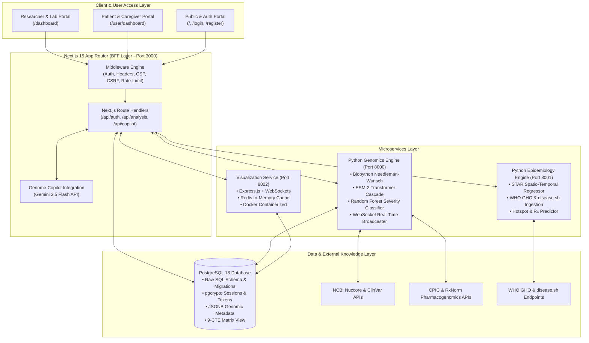
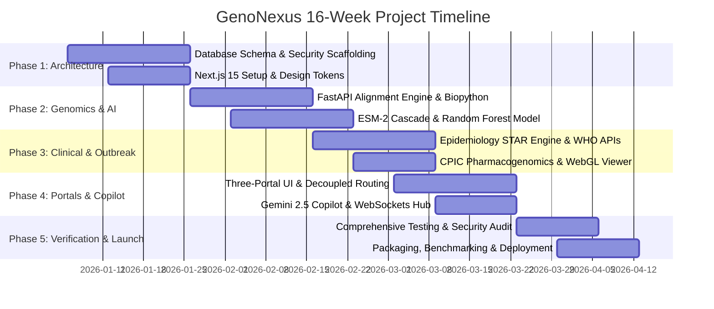

# Project Proposal: GenoNexus — Enterprise-Grade Bioinformatics, Precision Genomics, and Epidemiological Surveillance Platform

---

## 1. Introduction

In an era where genomic sequencing technologies have advanced exponentially, the capability to translate raw genetic code into actionable, life-saving clinical and public health decisions remains one of the most critical frontiers of modern medicine. The core problem confronting modern healthcare systems—particularly in low- and middle-income countries (LMICs) such as Bangladesh—is the profound disconnect between raw genomic sequencing data and clinical utility: genetic testing is prohibitively expensive, data analysis relies on overseas laboratories with multi-month turnaround times, and resulting reports are shrouded in dense technical jargon that alienates treating physicians and patients alike. To solve this systemic bottleneck, **GenoNexus** introduces an enterprise-grade, cloud-native bioinformatics and precision medicine platform that combines automated sequence alignment, transformer-based protein language models (ESM-2), machine learning pathogenicity scoring, and pharmacogenomics with an unprecedented Three-Portal ecosystem (Researcher, Patient, and Public) and a bilingual AI Genome Copilot. 

The remainder of this proposal is structured to present the conceptual, architectural, and operational dimensions of the project:
- **Section 2 (Motivation)** examines the historical context of genomic data analysis, the acute public health urgency in underserved regions, the shortcomings of existing proprietary and open-source tools, and the overarching vision of GenoNexus.
- **Section 3 (Project Details)** details the implementation environment (languages, microservices, databases, and system diagrams), analyzes key technical hurdles and mitigation strategies, delineates the project’s multi-phase deliverables and distinct feature sets, and outlines a structured project timeline.
- **Section 4 (Conclusion)** synthesizes the core findings, societal impact, and translational value proposition of the system.
- **Section 5 (References)** provides a comprehensive bibliography of peer-reviewed literature, genomic databases, and software standards foundational to this proposal.

---

## 2. Motivation

### 2.1 History and Origin of the Problem
The genesis of modern genomic medicine traces back to the completion of the Human Genome Project in 2003, which required nearly $3 billion and over a decade of international collaboration. Over the ensuing two decades, the emergence of Next-Generation Sequencing (NGS) and High-Throughput Sequencing (HTS) precipitated a collapse in raw sequencing costs—from $100,000 per genome in 2009 to under $200 today, with industry trajectories targeting sub-$50 genomes by 2030. However, this exponential efficiency in biochemical sequencing was not matched by democratization in computational interpretation. The "interpretive gap" emerged: while generating gigabytes of FASTQ or VCF data became routine, processing and clinically contextualizing those variants remained confined to high-resource bioinformatics clusters in North America and Western Europe. Developing nations and resource-constrained health systems were left in a position of technological dependency, forced to ship physical blood and tissue samples abroad, incurring exorbitant tariffs ($500 to $1,000 per comprehensive panel) and debilitating logistical delays of 8 to 12 weeks.

### 2.2 Public Health Significance and Regional Urgency
This computational bottleneck is not merely an academic limitation; it is an acute humanitarian crisis. In developing countries such as Bangladesh—a densely populated nation of over 170 million people—genomic disease burdens are extraordinarily high. Over 10 million individuals carry beta-thalassemia traits, leading to thousands of preventable hereditary anemia births annually. In oncology, pathogenic mutations in *BRCA1* and *BRCA2* go largely undetected, leaving women to present with stage III and IV breast and ovarian cancers when curative interventions are impossible. Furthermore, infectious disease dynamics pose relentless challenges: Bangladesh witnessed over 300,000 documented dengue infections during the historic 2023 outbreak, alongside rising burdens of human immunodeficiency virus (HIV-1/2) and multidrug-resistant tuberculosis. Critically, there are fewer than 50 certified clinical geneticists across the entire country. Without automated, localized computational infrastructure, clinical institutions such as Bangabandhu Sheikh Mujib Medical University (BSMMU), the International Centre for Diarrhoeal Disease Research, Bangladesh (icddr,b), and the Directorate General of Health Services (DGHS) lack the software tooling needed to perform point-of-care genomic triage.

### 2.3 Etiology, Timing, and Locus of the Problem
The problem manifests at the exact juncture where sequencing hardware outputs raw nucleotide reads and clinical practitioners must formulate a therapy regimen. It occurs during acute viral outbreaks when mutations in the viral envelope or polymerase genes confer immune escape or antiretroviral resistance (e.g., the K103N non-nucleoside reverse transcriptase inhibitor resistance mutation in HIV-1). It occurs during oncology chemotherapy planning when an unprofiled cytochrome P450 enzyme (*CYP2C19*, *CYP2D6*, or *DPYD*) leads to fatal drug toxicity or total therapeutic failure. Geographically, this problem is situated across district hospitals, regional diagnostic centers, and national surveillance institutes that have access to local PCR or benchtop sequencer outputs but have zero software pipelines to align sequences, identify single nucleotide polymorphisms (SNPs) and indels, annotate clinical severities, and translate these biological signatures into actionable language.

### 2.4 Critique of Existing Solutions
Current market solutions fail to address these systemic needs:
1. **Commercial SaaS Platforms (e.g., Illumina BaseSpace, DNAnexus, Seven Bridges):** While computationally sophisticated, these platforms impose steep recurring subscription models and cloud-compute markups designed exclusively for well-funded Western pharmaceutical conglomerates and research consortia. They are economically non-viable for public hospitals in developing nations.
2. **Academic Workflow Managers (e.g., Galaxy, Nextflow, Snakemake):** These systems require specialized Linux system administration, bash scripting knowledge, and cluster compute management. They completely lack point-of-care clinical interfaces, patient communication portals, and real-time collaborative communication.
3. **Public Databases (e.g., NCBI BLAST Web, Stanford HIVDB, ClinVar Web):** These resources exist as fragmented, disconnected web forms. A clinician must manually copy-paste FASTA strings across four or five disparate websites, manually harmonize nomenclature, and parse raw biochemical notations without integrated decision support.
4. **Communication Void:** None of the existing tools bridge the chasm between the scientist, the treating clinician, and the patient. None provide localized, bilingual interpretations (such as Bengali and English) or patient-facing appointment and referral workflows.

```
Existing Paradigms:
[ Raw DNA Sequencer ] ───► [ Fragmented Command-Line Tools ] ───► [ Cryptic 80-Page PDF ] ───► [ Clinical Paralysis / Disconnected Patient ]

GenoNexus Paradigm:
[ Raw DNA Sequencer ] ───► [ Unified GenoNexus Pipeline Engine ] ───┬───► [ Researcher Portal: Needleman-Wunsch + ESM-2 + 3D WebGL ]
                                                                     ├───► [ Clinician Portal: CPIC Pharmacogenomics + Referral System ]
                                                                     └───► [ Patient Portal: Plain-Language Bilingual Health Action Plan ]
```

### 2.5 The GenoNexus Value Proposition and Competitive Advantage
GenoNexus overcomes these systemic barriers by introducing a holistic, localized, and mathematically rigorous precision medicine architecture:
- **Three-Portal Role-Based Experience:** Distinct, decoupled interfaces tailored for laboratory researchers (`/dashboard`), clinicians and caregivers (`/user/dashboard`), and the general public (`/`), ensuring cognitive clarity, privacy, and regulatory separation.
- **Dual-Source Reference Ingestion & Multi-Format Support:** Ingests FASTA, FASTQ, VCF, and BAM files, supporting automated reference sequence streaming directly from NCBI Nuccore URLs or local custom uploads.
- **Three-Tier ESM-2 AI Variant Pathogenicity Prediction:** Combines classical dynamic programming sequence alignment (Needleman-Wunsch) with Evolutionary Scale Modeling (ESM-2 protein transformer) and a trained 6-feature Random Forest classifier (evaluating transition/transversion ratios, GC content, codon positions, functional domains, and drug-resistance loci).
- **Embedded Pharmacogenomics & Live CPIC Engine:** Direct integration with the Clinical Pharmacogenetics Implementation Consortium (CPIC) REST API and RxNorm mapping, converting detected star-alleles into concrete drug advisories (contraindications, dosing adjustments, FDA warnings).
- **Spatiotemporal Epidemic Intelligence:** A dedicated epidemiology engine ingesting real-time data from the World Health Organization (WHO GHO API) and disease.sh to model regional transmission trajectories, effective reproduction numbers ($R_0$), and hotspot clusters.
- **Democratized AI Genome Copilot:** Powered by Google Gemini 2.5 Flash, providing contextualized, prompt-injected clinical explanations and generating bilingual (English and Bengali) prevention and management plans.

### 2.6 Overarching Project Objective
The fundamental objective of this project is to construct, validate, and deploy an enterprise-grade, open-architecture bioinformatics and precision genomics platform that eliminates the interpretive bottleneck in low-resource and clinical settings—democratizing genomic medicine from a distant, cost-prohibitive privilege into an immediate, localized, and life-saving utility.

---

## 3. Project Details

### 3.1 Environment

#### 3.1.1 Software and Architectural Ecosystem
The GenoNexus platform is engineered as a decoupled, multi-tier microservice ecosystem that balances high-concurrency client rendering, stateful relational consistency, computationally heavy bioinformatics routines, and real-time distributed collaboration. The system comprises four core layers:
1. **Frontend & BFF (Backend-for-Frontend):** Built with Next.js 15 (App Router), React 19, and TypeScript 5.7. It leverages server-side rendering (SSR) and React Server Components (RSC) for initial page loads and search engine visibility, coupled with client-side state hydration for interactive analytical consoles. Styling is governed by a bespoke "Matte Dark / Liquid Glass" design system utilizing CSS Modules, HSL color tokens, glassmorphism, and responsive viewports.
2. **Genomics Engine Microservice (Port 8000):** A Python 3.10+ / FastAPI service dedicated to heavy computational biology algorithms. It integrates Biopython for pairwise alignment and file parsing, scikit-learn for Random Forest severity modeling, PyTorch/Hugging Face Transformers for ESM-2 zero-shot embeddings, and WebSockets for real-time pipeline event broadcasting.
3. **Epidemiology Microservice (Port 8001):** A Python 3.10+ / FastAPI service running a Spatio-Temporal Autoregressive (STAR) Random Forest regression pipeline that periodically ingests, normalizes, and forecasts infectious disease data from disease.sh and WHO GHO endpoints.
4. **Visualization Microservice & Cache (Port 8002):** A Node.js/Express service containerized via Docker, interfacing with Redis for high-frequency caching and WebSocket streaming of 3D WebGL chromosome map coordinates.
5. **Relational Database Engine:** PostgreSQL 14+ (tested on PostgreSQL 18) utilizing the `pg` client without an intermediary Object-Relational Mapper (ORM) to maintain full control over query performance, connection pooling, and advanced relational constructs (including `pgcrypto` cryptographic token hashing, JSONB document storage, and complex multi-CTE analytical views like `vw_geno_nexus_matrix`).



#### 3.1.2 Hardware Environment and Deployment Specifications
- **Development Workstations:** Standard multi-core workstations equipped with 8-core/16-thread CPUs (AMD Ryzen 7 or Intel Core i7), 16 GB to 32 GB DDR4/DDR5 RAM, and high-speed NVMe SSD storage. While GPU acceleration (CUDA) is supported for accelerated ESM-2 transformer inference, the pipeline is explicitly optimized for CPU execution through lightweight transformer quantization (`esm2_t6_8M_UR50D`, ~30MB footprint) to ensure total portability in resource-limited clinic environments.
- **Production Cloud Architecture:** Designed for horizontal containerized orchestration via Docker and Kubernetes. The web layer is deployable on modern edge infrastructures (e.g., Vercel, AWS ECS, or DigitalOcean Kubernetes), while the PostgreSQL cluster operates with dedicated connection poolers (PgBouncer) and read-replicas. Regional edge points located in South Asia (e.g., AWS Mumbai region) ensure sub-5ms round-trip latency to healthcare facilities in Dhaka, Chittagong, and Sylhet.

#### 3.1.3 Technology Stack Summary

| Domain | Core Technologies & Libraries | Key Function / Responsibility |
|:---|:---|:---|
| **Frontend Framework** | Next.js 15.1, React 19, TypeScript 5.7 | Server-side rendering, responsive portals, BFF routing, component lifecycle |
| **Styling & Design System** | Custom CSS Modules, Design Tokens | Glassmorphism, Matte Dark palette, dynamic data density, mobile responsiveness |
| **Data Visualization** | HTML5 Canvas, WebGL, Lucide React Icons | Interactive 3D chromosome mapping, mutation density pins, epidemiological charts |
| **Authentication & Security** | Next.js Middleware, Firebase Admin, `otplib`, `pgcrypto` | Session token hashing, TOTP 2FA, CSRF defense, rate-limiting, audit logging |
| **Database Engine** | PostgreSQL 18 (`pg` pool, raw SQL) | ACID transactions, JSONB genomic storage, 9-CTE analytical views |
| **Bioinformatics Engine** | Python 3.10+, FastAPI, Biopython SeqIO/Align | Pairwise Needleman-Wunsch alignment, FASTA/FASTQ parsing, variant extraction |
| **Machine Learning & AI** | scikit-learn, PyTorch, Transformers, Gemini 2.5 Flash | ESM-2 zero-shot log-likelihoods, Random Forest classifier, clinical chat copilot |
| **Epidemiological Modeling** | NumPy, scikit-learn, Pydantic, disease.sh, WHO GHO | Spatial autoregressive forecasting, $R_0$ reproduction modeling, hotspot alerts |
| **Collaboration & Transport** | WebSockets (`ws`, FastAPI WebSockets), Redis | Live activity stream, hypothesis board chat, pipeline status broadcasting |
| **Testing & Quality Assurance** | Jest 30, `@testing-library/react`, Pytest, Pytest-Asyncio | Unit, integration, and end-to-end regression validation across frontend and backend |

---

### 3.2 Issues and Challenges for Implementation

#### 3.2.1 Algorithmic Complexity and Computational Scaling
The primary technical challenge in comparative genomics is the computational complexity of sequence alignment. The classical Needleman-Wunsch dynamic programming algorithm guarantees a mathematically optimal global alignment but scales quadratically in both time and space:

$$\mathcal{O}(M \times N)$$

where $M$ and $N$ represent sequence lengths. For small viral genomes (such as HIV-1 at ~9.7 kb or SARS-CoV-2 at ~29.9 kb), alignment executes within milliseconds on modern CPUs. However, scaling to larger viral genomes, bacterial sequences, or multi-exon human genes (such as the 100 kb genomic region of *BRCA1*) can lead to memory exhaustion and server timeouts. To mitigate this without sacrificing mathematical rigor, GenoNexus implements an adaptive alignment architecture: Biopython’s C-accelerated alignment kernel is utilized for exact global comparisons, coupled with automated FASTA header parsing and targeted gene-region extraction based on pre-seeded coordinate maps.

#### 3.2.2 Transformer Inference Overhead and Fallback Engineering
Integrating deep learning protein language models into real-time web applications presents acute latency and hardware challenges. State-of-the-art transformer architectures such as ESM-2 (Evolutionary Scale Modeling) capture profound evolutionary constraints through masked language modeling, but evaluating log-likelihood ratios across every mutated amino acid can impose significant compute penalties on hardware lacking dedicated GPUs. GenoNexus resolves this through an innovative **Three-Tier ESM-2 Prediction Cascade**:

```
[ Mutation Detected ]
         │
         ▼
[ Tier 1: Local PyTorch CPU ] ──(If torch & esm2_t6_8M available)──► Fast Local Log-Likelihood Ratio
         │ (Fallback if local model missing/OOM)
         ▼
[ Tier 2: Hugging Face API ] ──(If HF_TOKEN configured)────────────► Serverless Cloud Inference
         │ (Fallback if API offline or rate-limited)
         ▼
[ Tier 3: BLOSUM62 Baseline ] ─────────────────────────────────────► Empirical Amino Acid Substitution Log-Odds
```

This tiered architecture guarantees zero service interruption: high-performance hardware enjoys rich transformer embeddings, cloud-connected instances leverage serverless APIs, and air-gapped or compute-constrained rural clinics seamlessly fall back to empirical biochemical substitution scoring.

#### 3.2.3 Translational Privacy, Regulatory Compliance, and Role Separation
Bioinformatics systems handle intensely sensitive, identifiable Protected Health Information (PHI). A core challenge was architecting a system where laboratory researchers, medical specialists, and non-technical patients interact with the same underlying clinical data while strictly enforcing regulatory access boundaries. GenoNexus overcomes this through:
- **Middleware-Enforced Role Separation:** Next.js `middleware.ts` inspects cryptographically signed session tokens and enforces role-based routing boundaries (`/dashboard/*` vs. `/user/*`) before requests reach application logic.
- **Defense-in-Depth Security Controls:** SHA-256 session token hashing, per-session CSRF token validation, strict Content Security Policies (CSP), HTTP Strict Transport Security (HSTS), and exhaustive audit logging in the `audit_logs` table.
- **Role-Aware AI Context Injection:** The Gemini 2.5 Flash Genome Copilot dynamically adapts its output schemas based on user identity: clinicians receive technical mutation classifications with CPIC references and ESM-2 scores, whereas patients receive empathetic, plain-language summaries localized into Bengali and English.

---

### 3.3 Deliverables

The GenoNexus project delivers a fully integrated, production-ready biomedical software suite divided across five comprehensive modules:

#### 3.3.1 Module 1: The Multi-Format Genomics Engine & Alignment Pipeline
This deliverable constitutes the core computational pipeline running within the Python FastAPI microservice. It provides robust ingestion of FASTA, FASTQ, VCF, and BAM sequence formats. It features an automated organism recognition subsystem that parses FASTA metadata headers to map queries against ten pre-loaded reference genomes (including HIV-1, HIV-2, SARS-CoV-2, Influenza A/B, Hepatitis B/C, Dengue-1, Ebola, and Monkeypox). The engine performs Needleman-Wunsch global alignment, extracts all single nucleotide polymorphisms (SNPs) and insertions/deletions (indels), evaluates GC context windows ($\pm 10$ bp), transition/transversion ratios ($Ts/Tv$), and outputs structured mutation records. It generates definitive empirical evidence of sequence homology, identity percentage, and functional domain disruptions.

#### 3.3.2 Module 2: Hybrid AI Pathogenicity & Severity Classification Suite
This deliverable provides machine learning-driven mutation scoring. Moving beyond basic heuristics, it deploys a trained 6-feature Random Forest classifier integrated with the Three-Tier ESM-2 prediction cascade. Each detected variant is scored for:
- Pathogenicity severity (`high`, `medium`, `low`).
- AI confidence metric ($0.0 \to 1.0$).
- ESM-2 log-likelihood ratio ($\log P(\text{mutant}) - \log P(\text{wildtype})$).
- Cross-referenced clinical annotations from NCBI ClinVar (review status, accession, and phenotype) and the Stanford HIV Drug Resistance Database (HIVDB).

#### 3.3.3 Module 3: Precision Pharmacogenomics & Outbreak Surveillance Engines
This deliverable bridges benchtop genomics with clinical prescribing and public health epidemiology:
- **Pharmacogenomics Engine (`/dashboard/drugs`):** Ingests detected patient variants, matches star-allele phenotypes across ten essential metabolic enzymes (*CYP2C19*, *CYP2D6*, *CYP3A5*, *TPMT*, *DPYD*, *SLCO1B1*, *VKORC1*, *G6PD*, *HLA-B*, and *CFTR*), queries the live CPIC REST API and dynamic RxNorm database, and generates printable clinical prescribing reports detailing drug advisories, FDA black-box warnings, and dosing adjustments.
- **Disease Outbreak Predictor (`/dashboard/outbreak`):** Powered by the Epidemiology Microservice, this module executes Spatio-Temporal Autoregressive (STAR) models on dynamic epidemiological streams (disease.sh and WHO GHO API). It delivers interactive disease trajectory forecasts across 6-month, 1-year, and 5-year horizons, hot-spot classifications, and real-time effective reproduction number ($R_0$) estimations for COVID-19, HIV, and influenza strains.

#### 3.3.4 Module 4: Three-Portal Responsive Web Application & WebGL Chromosome Viewer
The user-facing ecosystem built on Next.js 15:
- **Researcher & Clinical Command Center (`/dashboard`):** Real-time KPI counters, DNA file upload station supporting NCBI Nuccore direct URL streaming, deep analytical tabular inspectors with search and filtering, and the interactive **3D Chromosome Map Viewer** (`GenomeBrowser.tsx`) rendering mutation pins color-coded by AI severity over WebGL canvas contexts.
- **Research Collaboration Hub (`/dashboard/collaboration`):** An interactive digital workspace featuring a live WebSocket Activity Stream, an editable Hypothesis Board with per-hypothesis threaded AI discussions, and a real-time Pipeline Engine tracker illustrating multi-stage progress (QC $\to$ Align $\to$ Call $\to$ Predict $\to$ Enrich).
- **Patient & Caregiver Portal (`/user/dashboard`):** A compassionate, non-technical portal where patients view simplified genetic health results, download bilingual clinical reports, track longitudinal health appointments, and receive automated specialist referral recommendations based on identified genetic risks.

#### 3.3.5 Module 5: Bilingual Genome Copilot (AI Assistant) & Security Infrastructure
The clinical intelligence and governance layer:
- **Genome Copilot:** An intelligent assistant powered by Google Gemini 2.5 Flash, contextually aware of the active user’s latest sequence analysis, uploaded files, and pipeline runs. It operates in both free-form clinical dialogue mode and structured `prevention_plan` generation mode, outputting complete bilingual translations in Bengali and English.
- **Enterprise Security Suite:** Full implementation of two-factor authentication (TOTP via `otplib`), rate-limiting algorithms, cryptographic session storage in PostgreSQL, CSRF defenses, automated database backup scripts, and the comprehensive 9-CTE analytical matrix view (`vw_geno_nexus_matrix`).

---

### 3.4 Timeline

The implementation, verification, and deployment lifecycle of GenoNexus is organized into five successive development phases spanning a 16-week execution horizon:

| Phase | Duration | Focus Area | Key Milestones & Deliverables |
|:---|:---|:---|:---|
| **Phase 1** | Weeks 1–3 | **Foundations & Architecture** | Complete system specification; database schema migration design (`schema.sql`, `pgcrypto` setup); Next.js 15 project scaffolding and "Liquid Glass" design token configuration; authentication subsystem (Firebase OAuth + email/password + TOTP 2FA); initial repository governance and CI/CD pipelines. |
| **Phase 2** | Weeks 4–7 | **Bioinformatics & AI Core** | Implementation of Python FastAPI Genomics Engine (Port 8000); integration of Biopython Needleman-Wunsch pairwise alignment and multi-format sequence parsers (FASTA/FASTQ/VCF/BAM); implementation of the Three-Tier ESM-2 prediction cascade; training and validation of the 6-feature Random Forest variant severity classifier; NCBI Nuccore URL streaming integration. |
| **Phase 3** | Weeks 8–10 | **Clinical & Public Health Modules** | Construction of the Python Epidemiology Engine (Port 8001); ingestion of disease.sh and WHO GHO APIs with STAR regression forecasting; development of the Pharmacogenomics Engine with live CPIC API and RxNorm star-allele mapping; creation of the WebGL 3D Chromosome Browser canvas component. |
| **Phase 4** | Weeks 11–13 | **Three-Portal Integration & Copilot** | Completion of Researcher (`/dashboard`) and Patient (`/user/dashboard`) portals; integration of Google Gemini 2.5 Flash Genome Copilot with contextual prompt injection and bilingual (Bengali/English) output schemas; real-time WebSocket collaboration hub (Activity Stream, Hypothesis Board, Pipeline Engine tracker). |
| **Phase 5** | Weeks 14–16 | **Validation, Hardening & Launch** | Comprehensive test execution (Jest frontend tests, Pytest backend suites, end-to-end alignment benchmark validations); security auditing (penetration testing, CSP/CSRF/rate-limit verification); database indexing and query optimization on `vw_geno_nexus_matrix`; documentation finalization and production deployment packaging via `START_ALL.bat` and Docker. |



---

## 4. Conclusion

GenoNexus represents a transformative leap forward in translational bioinformatics, precision diagnostics, and infectious disease surveillance. By confronting the acute computational divide that separates modern high-throughput sequencing from everyday clinical practice—especially in medically underserved regions such as Bangladesh—the platform replaces months of waiting and exorbitant overseas outsourcing costs with immediate, mathematically rigorous, point-of-care intelligence. 

Through its pioneering Three-Portal architecture, GenoNexus harmonizes the clinical lab, treating physicians, and vulnerable patients within a unified, secure digital ecosystem. Its computational foundation synthesizes the gold-standard exactness of Needleman-Wunsch pairwise alignment, the evolutionary intelligence of ESM-2 protein language transformers, the clinical authority of CPIC pharmacogenomics, and the spatiotemporal foresight of machine-learned epidemiological forecasting. Layered with the bilingual Google Gemini 2.5 Flash Genome Copilot, complex genetic mutations are converted into clear, actionable, life-saving therapeutic interventions in both Bengali and English. GenoNexus is not merely a software application; it is an open, scalable, and reproducible blueprint for national genomic healthcare sovereignty.

---

## 5. References

1. **Needleman, S. B., & Wunsch, C. D. (1970).** A general method applicable to the search for similarities in the amino acid sequence of two proteins. *Journal of Molecular Biology*, 48(3), 443–453. https://doi.org/10.1016/0022-2836(70)90057-4
2. **Lin, Z., Akin, H., Rao, R., Hie, B., Zhu, Z., Lu, W., Smetanin, N., Verkuil, R., Kabeli, O., Shmueli, Y., dos Santos Costa, A., Fazel-Zarandi, M., Sriram, A., Candido, P., & Rives, A. (2023).** Evolutionary-scale prediction of atomic-level protein structure with a language model. *Science*, 379(6637), 1123–1130. https://doi.org/10.1126/science.ade2574
3. **Rives, A., Meier, J., Sercu, T., Goyal, S., Lin, Z., Liu, J., Guo, D., Ott, M., Zitnick, C. L., Ma, J., & Fergus, R. (2021).** Biological structure and function emerge from scaling unsupervised learning to 250 million protein sequences. *Proceedings of the National Academy of Sciences (PNAS)*, 118(15), e2016239118. https://doi.org/10.1073/pnas.2016239118
4. **Landrum, M. J., Lee, J. M., Benson, M., Brown, G. R., Chao, C., Chitipothu, S., Fan, H., Hart, J., Hoffman, D., Jang, W., Karapetyan, K., Katz, K., Liu, C., Madden, T. L., Malheiro, A., McDaniel, K., Ovetsky, M., Riley, G., Zhou, G., Holmes, J. B., Kattman, B. L., & Maglott, D. R. (2020).** ClinVar: improving access to variant interpretations and supporting evidence. *Nucleic Acids Research*, 48(D1), D835–D844. https://doi.org/10.1093/nar/gkz972
5. **Rhee, S. Y., Gonzales, M. J., Kantor, R., Betts, B. J., Ravela, J., & Shafer, R. W. (2003).** Human immunodeficiency virus reverse transcriptase and protease sequence database. *Nucleic Acids Research*, 31(1), 298–303. https://doi.org/10.1093/nar/gkg100
6. **Caudle, K. E., Klein, T. E., Hoffman, J. M., Müller, D. J., Whirl-Carrillo, M., Gong, L., McDonagh, E. M., Sangkuhl, K., Thorn, C. F., Schwab, M., Agúndez, J. A., Freimuth, R. R., Huser, V., Lee, M. T., Iwuchukwu, O. F., Crews, K. R., Scott, S. A., Wadelius, M., Swen, J. J., ... & Relling, M. V. (2014).** Incorporation of pharmacogenomics into routine clinical practice: the Clinical Pharmacogenetics Implementation Consortium (CPIC) guideline development process. *Current Drug Metabolism*, 15(2), 209–217. https://doi.org/10.2174/1389200215666140130124910
7. **Cock, P. J., Antao, T., Chang, J. T., Chapman, B. A., Cox, C. J., Dalke, A., Friedberg, I., Hamelryck, T., Kauff, F., Wilczynski, B., & de Hoon, M. J. (2009).** Biopython: freely available Python tools for computational molecular biology and bioinformatics. *Bioinformatics*, 25(11), 1422–1423. https://doi.org/10.1093/bioinformatics/btp163
8. **Jumper, J., Evans, R., Pritzel, A., Green, T., Figurnov, M., Ronneberger, O., Tunyasuvunakool, K., Bates, R., Žídek, A., Potapenko, A., Bridgland, A., Meyer, C., Kohl, S. A., Ballard, A. J., Cowie, A., Romera-Paredes, B., Nikolov, S., Jain, R., Adler, J., ... & Hassabis, D. (2021).** Highly accurate protein structure prediction with AlphaFold. *Nature*, 596(7873), 583–589. https://doi.org/10.1038/s41586-021-03819-2
9. **Breiman, L. (2001).** Random Forests. *Machine Learning*, 45(1), 5–32. https://doi.org/10.1023/A:1010933404324
10. **Henikoff, S., & Henikoff, J. G. (1992).** Amino acid substitution matrices from protein blocks. *Proceedings of the National Academy of Sciences (PNAS)*, 89(22), 10915–10919. https://doi.org/10.1073/pnas.89.22.10915
11. **World Health Organization. (2023).** *Dengue and severe dengue: Global situation and response.* World Health Organization Regional Office for South-East Asia. https://www.who.int/emergencies/disease-outbreak-news/item/2023-DON489
12. **World Health Organization. (2024).** *Global Health Observatory (GHO) data repository.* World Health Organization. https://www.who.int/data/gho
13. **Directorate General of Health Services (DGHS). (2020).** *Bangladesh National Digital Health Strategy 2020–2025.* Ministry of Health and Family Welfare, Government of the People’s Republic of Bangladesh.
14. **Nelson, S. J., Zeng, K., Kilbourne, J., Powell, T., & Moore, R. (2011).** Normalized names for clinical drugs: RxNorm at 6 years. *Journal of the American Medical Informatics Association*, 18(4), 441–448. https://doi.org/10.1136/amiajnl-2011-000116
15. **Open Disease Data Agency. (2024).** *disease.sh - Open Disease Data API documentation.* https://disease.sh/docs/
